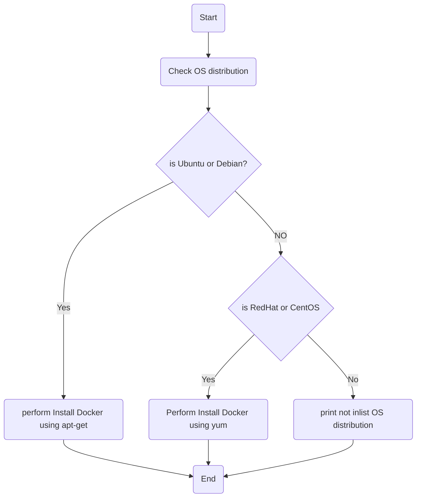

# Task1:
write a bash script do this:\
    1- Detect OS distribution.\
    2- Based on OS distribution decide to use apt-get or yum to install docker.
## Flowchart:

## How to Run the Script:
1- clone github repo to your local system:
```
git clone https://github.com/MahmoudAbelaziz22/Fawry_internship.git

```
2- change your current directory to task1 directory:
```
cd ./Fawry internship/Tasks/Task1
```
3- give excution permission to main.sh and helper-functions.sh files:

```
 chmod +x main.sh helper-functions.sh 
```
4- Run main.sh script and enjoy ^_^ :
```
./main.sh
```
