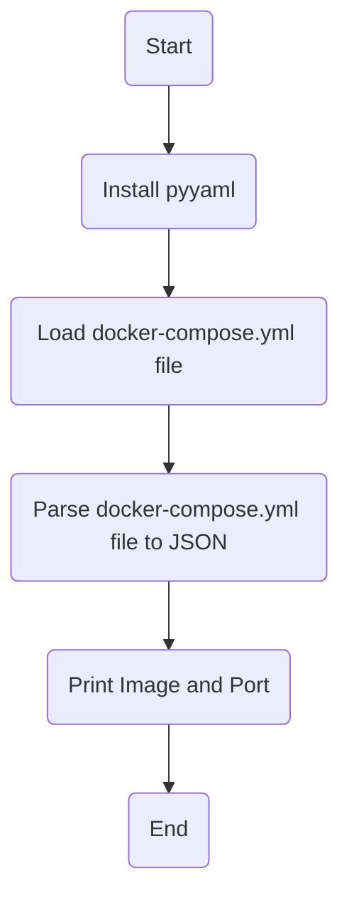

# Task2: 
write a script that do this:\
    1- read .yaml file ( ex:" docker-compose.yaml").\
    2-parse it into json format and edit image value.\
    3- then parse it back into .yaml format.

## Flowchart:

## How to run the script:
there is two approchs to do that:\
    1- Use pyyaml python lib.\
    2- Use jq and yq python libs.

### 1- Use pyyaml python lib:
1- clone github repo to your local system:
```
git clone https://github.com/MahmoudAbelaziz22/Fawry_internship.git

```
2- change your current directory to task2 directory:
```
cd ./Fawry internship/Tasks/Task2
```
3- Run parse_yaml_pyyaml_way.py script and enjoy ^_^ :
```
python3 ./parse_yaml_pyyaml_way.py
```

### 2- Use jq and yq python libs:
1- clone github repo to your local system:
```
git clone https://github.com/MahmoudAbelaziz22/Fawry_internship.git

```
2- change your current directory to task2 directory:
```
cd ./Fawry internship/Tasks/Task2
```
3- give excution permission to yaml_parse.sh and helper-functions.sh files:

```
 chmod +x yaml_parser.sh helper_functions.sh 
```
4- Run yaml_parser.sh script and enjoy ^_^ :

```
./yaml_parser.sh
```