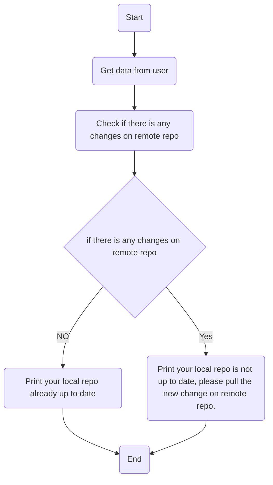

# Task3:
write bash script to check if there is any new update on remote repo, if your local repo contain the last commit on the remote repo print ("Your local repo already up to date."), and if your local repo does not contain the last commit on the remote repo then print ("Your local repo is not up to date, please pull the new change on remote repo.")

## Flowchart

## How to run the script:
1- clone github repo to your local system:
```
git clone https://github.com/MahmoudAbelaziz22/Fawry_internship.git

```
2- change your current directory to task3 directory:
```
cd ./Fawry internship/Tasks/Task3
```
3- give excution permission to check_master.sh and helper_functions.sh files:

```
 chmod +x check_master.sh helper_functions.sh 
```
4- Run check_master.sh script and enjoy ^_^ :
```
./check_master.sh
```