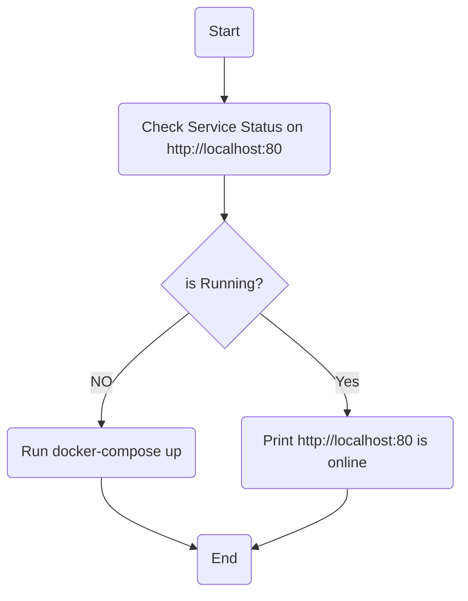

# Task1:
write a bash script do this:\
    1- Check service up & running using ip address and port number.\
    2- if the service is not running, run docker-compose up to run it.
## Flowchart:

## How to Run the Script:
1- clone github repo to your local system:
```
git clone https://github.com/MahmoudAbelaziz22/Fawry_internship.git

```
2- change your current directory to task5 directory:
```
cd ./Fawry internship/Tasks/Task5
```
3- give excution permission to check_service.sh and helper_functions.sh files:

```
 chmod +x check_service.sh helper_functions.sh 
```
4- Run check_service.sh script and enjoy ^_^ :
```
sudo ./check_service.sh
```