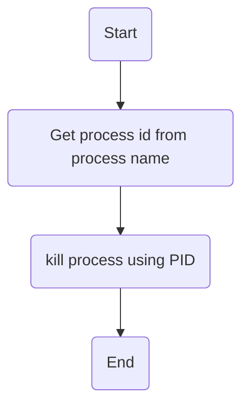

# Task6:
write a bash script do this:\
    1- get the process id from process name.\
    2- use process id to kill the process.
## Flowchart:

## How to Run the Script:
1- clone github repo to your local system:
```
git clone https://github.com/MahmoudAbelaziz22/Fawry_internship.git

```
2- change your current directory to task6 directory:
```
cd ./Fawry internship/Tasks/Task6
```
3- give excution permission to kill_process.sh and helper_functions.sh files:

```
 chmod +x kill_process.sh helper_functions.sh 
```
4- Run kill_process.sh script and enjoy ^_^ :
```
sudo ./kill_process.sh
```
