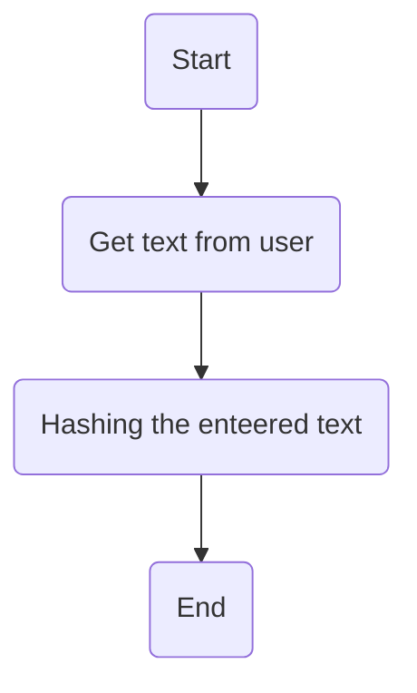

# Task7: 
write a script that do this:\
    1- get password or any text from user.\
    2- use hashlib to hash the entered text.\
## Flowchart:

## How to run the script:

1- clone github repo to your local system:
```
git clone https://github.com/MahmoudAbelaziz22/Fawry_internship.git

```
2- change your current directory to task7 directory:
```
cd ./Fawry internship/Tasks/Task7
```
3- Run hashing.py script and enjoy ^_^ :
```
python3 ./hashing.py
```